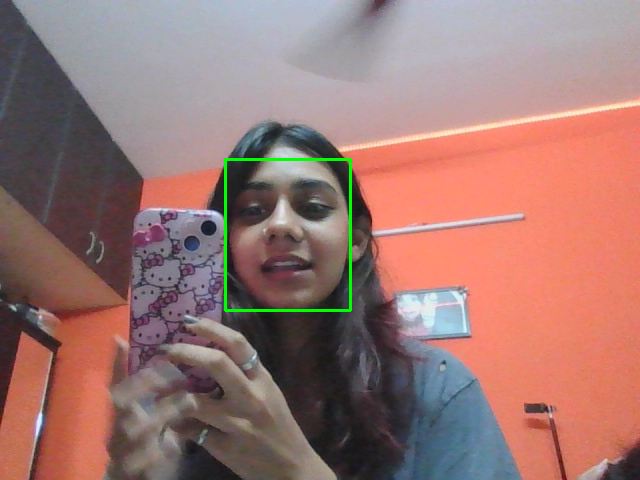

# 🎭 AI Mood Mirror Pro

Real-time AI mood detection using OpenCV + MediaPipe with gesture-based controls.

---

## 🚀 Features
- 🎥 Live webcam emotion detection  
- 😊 Detects smiling (with or without teeth)  
- ✋ Gesture-based screenshot  
- 📊 Confidence percentage + UI bar  

---

## 📸 Demo


---

## ⚡ Run Locally
```bash
pip install -r requirements.txt
python mood_mirror.py
```

---

## 💡 How It Works

### 😊 Smile Detection Logic
- Face landmarks are detected using MediaPipe Face Mesh  
- Tracks mouth openness + curvature  
- Detects both:
  - 😊 teeth smile  
  - 🙂 soft smile  

---

### ✋ Gesture-Based Screenshot
- Uses thumb + index finger distance  
- Pinch gesture 🤏 triggers screenshot  
- Cooldown prevents spam  

---

### 📊 Confidence & UI Logic
- Confidence based on strength of smile  
- Displayed using progress bar  
- UI overlay shows emotion + percentage  

---

## 🎯 Controls
- Press `q` → Exit  
- Pinch fingers 🤏 → Screenshot  

---

## 👩‍💻 Author
Anoushka Nayak
